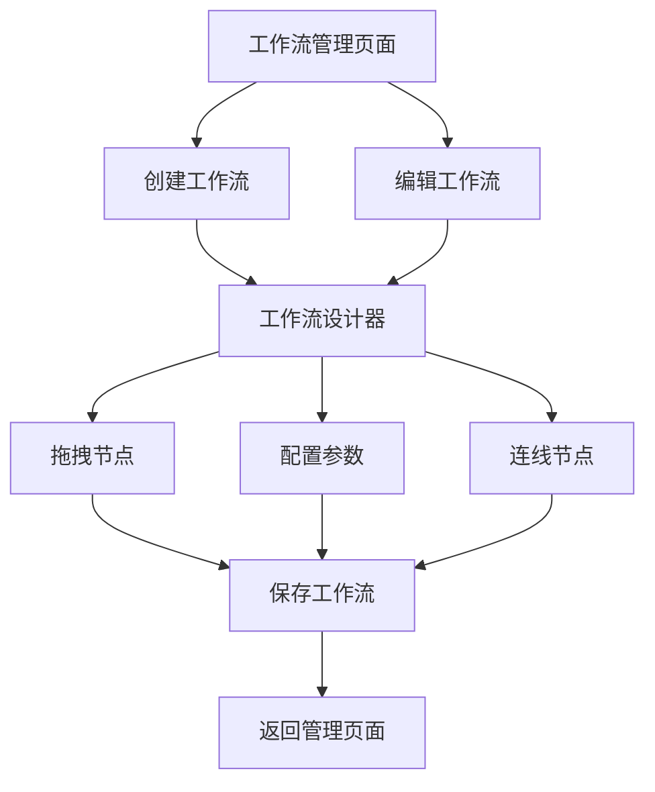

## 1. 产品概述
基于Vue3开发的工作流低代码平台，提供可视化拖拽画布和JSON Schema双向绑定渲染引擎，实现工作流节点的可视化编排、参数配置与数据联动。面向开发者和业务人员，降低工作流开发门槛，提升业务流程自动化效率。

## 2. 核心功能

### 2.1 用户角色
| 角色 | 注册方式 | 核心权限 |
|------|----------|----------|
| 普通用户 | 邮箱注册 | 创建工作流、编辑个人工作流、导出工作流 |
| 高级用户 | 邀请码升级 | 自定义节点、共享工作流模板、批量操作 |

### 2.2 功能模块
核心功能页面：
1. **工作流设计器**：可视化画布、节点拖拽、连线配置、参数面板
2. **工作流管理**：工作流列表、导入导出、模板管理
3. **节点库**：预设节点展示、自定义节点管理

### 2.3 页面详情
| 页面名称 | 模块名称 | 功能描述 |
|----------|----------|----------|
| 工作流设计器 | 可视化画布 | 支持节点拖拽、移动、删除、连线；画布缩放、平移、居中；撤销重做 |
| 工作流设计器 | 节点交互 | 选中高亮、hover显示操作按钮、连线自动吸附、对齐辅助线 |
| 工作流设计器 | 参数配置面板 | 基于JSON Schema渲染表单、双向绑定、实时校验、依赖联动 |
| 工作流设计器 | 工具栏 | 保存、导入、导出、清空、预览、节点库切换 |
| 工作流管理 | 工作流列表 | 展示所有工作流、搜索筛选、状态显示 |
| 工作流管理 | 导入导出 | JSON文件导入导出、批量操作、模板保存 |
| 节点库 | 预设节点 | 开始节点、结束节点、审批节点、API调用节点、分支节点 |
| 节点库 | 自定义节点 | 节点注册、Schema配置、图标设置、分类管理 |

## 3. 核心流程
用户进入工作流设计器页面，从左侧节点库拖拽节点到画布，连接节点形成流程，选中节点后在右侧面板配置参数，完成后保存工作流JSON。支持导入现有工作流进行编辑，导出工作流JSON文件。

## 4. 用户界面设计

### 4.1 设计风格
- 主色调：#1890ff（蓝色）辅助色：#52c41a（绿色）
- 按钮风格：圆角矩形，主要按钮使用主色调
- 字体：PingFang SC，标题16px，正文14px
- 布局：左侧节点库（200px）中间画布（自适应）右侧配置面板（300px）
- 图标：使用Ant Design图标库，线性风格

### 4.2 页面设计
| 页面名称 | 模块名称 | UI元素 |
|----------|----------|--------|
| 工作流设计器 | 画布区域 | 白色背景，网格辅助线，拖拽时显示虚线框 |
| 工作流设计器 | 节点样式 | 圆角矩形卡片，不同颜色区分节点类型，选中时蓝色边框 |
| 工作流设计器 | 参数面板 | 分组表单，必填项红色星号，校验错误红色提示 |
| 工作流管理 | 列表视图 | 卡片式布局，显示工作流名称、更新时间、状态标签 |
| 节点库 | 节点展示 | 图标+名称的网格布局，hover时显示描述信息 |

### 4.3 响应式设计
桌面端优先，支持1920x1080、1366x768等主流分辨率，画布区域自适应缩放，配置面板在窄屏时可收起。