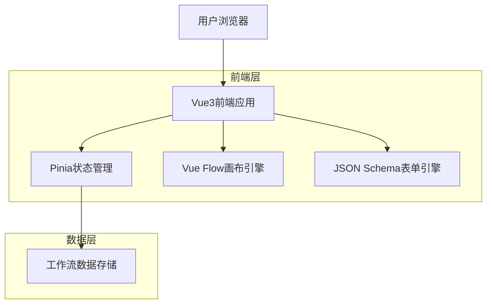
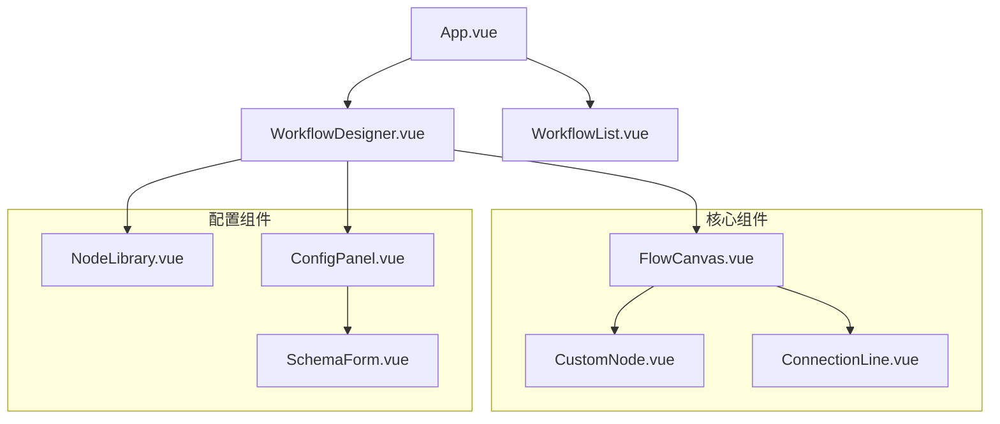

## 1. 架构设计



## 2. 技术栈描述
- 前端框架：Vue3@3.4 + Composition API + <script setup>语法
- 初始化工具：vite-init
- 构建工具：Vite@5.0
- 状态管理：Pinia@2.1
- 画布引擎：@vue-flow/core@1.33
- 表单渲染：@lljj/vue-json-schema-form@1.18
- 样式方案：Tailwind CSS@3.4 + Element Plus@2.5
- 类型安全：TypeScript@5.3
- 后端服务：无（纯前端应用，数据存储在localStorage）

## 3. 路由定义
| 路由 | 用途 |
|------|------|
| / | 工作流管理首页，展示工作流列表 |
| /designer | 工作流设计器，可视化编辑界面 |
| /designer/:id | 编辑指定ID的工作流 |
| /templates | 工作流模板库，预设模板展示 |
| /settings | 应用设置，包含主题、快捷键配置 |

## 4. 核心数据结构定义

### 4.1 工作流数据结构
```typescript
interface WorkflowNode {
  id: string
  type: 'start' | 'end' | 'approval' | 'api' | 'branch' | 'custom'
  position: { x: number; y: number }
  data: {
    label: string
    config: Record<string, any>
    schema: JSONSchema7
  }
}

interface WorkflowEdge {
  id: string
  source: string
  target: string
  type?: string
  label?: string
}

interface Workflow {
  id: string
  name: string
  description?: string
  nodes: WorkflowNode[]
  edges: WorkflowEdge[]
  viewport: { x: number; y: number; zoom: number }
  createdAt: number
  updatedAt: number
}
```

### 4.2 JSON Schema扩展接口
```typescript
interface CustomWidget {
  name: string
  component: Component
  validator?: (value: any) => boolean
}

interface SchemaDependency {
  property: string
  condition: any
  show: string[]
  hide: string[]
}
```

## 5. 组件架构



## 6. 状态管理设计

### 6.1 Pinia Store结构
```typescript
// useWorkflowStore.ts
interface WorkflowState {
  currentWorkflow: Workflow | null
  selectedNode: WorkflowNode | null
  nodeTypes: NodeTypeDefinition[]
  history: Workflow[]
  historyIndex: number
}

interface Actions {
  addNode: (type: string, position: Position) => void
  updateNodeConfig: (nodeId: string, config: any) => void
  connectNodes: (source: string, target: string) => void
  undo: () => void
  redo: () => void
  validateWorkflow: () => ValidationError[]
}
```

### 6.2 数据持久化
- 工作流数据存储在localStorage，key为`workflow_data_${id}`
- 自动保存机制：每30秒自动保存当前编辑的工作流
- 导入导出：支持完整的JSON文件导入导出，包含所有节点和配置信息

## 7. 核心算法实现

### 7.1 拖拽处理流程
1. 监听Vue Flow的`nodeDragStart`事件
2. 记录拖拽起始位置和节点类型
3. 在`nodeDragStop`时验证位置合法性（避免重叠）
4. 更新Pinia中的节点位置状态
5. 触发历史记录保存

### 7.2 JSON Schema双向绑定
1. 选中节点时，从节点数据中提取schema和config
2. 使用vue-json-schema-form渲染配置表单
3. 监听表单change事件，实时更新节点config
4. 使用`watch`监听节点数据变化，反向更新表单
5. 支持schema的dependencies联动逻辑

### 7.3 工作流验证算法
```typescript
function validateWorkflow(workflow: Workflow): ValidationError[] {
  const errors: ValidationError[] = []
  
  // 检查孤立节点
  const connectedNodes = new Set()
  workflow.edges.forEach(edge => {
    connectedNodes.add(edge.source)
    connectedNodes.add(edge.target)
  })
  
  workflow.nodes.forEach(node => {
    if (!connectedNodes.has(node.id) && node.type !== 'start') {
      errors.push({ type: 'isolated', nodeId: node.id })
    }
  })
  
  // 检查必填配置
  workflow.nodes.forEach(node => {
    const requiredFields = extractRequiredFields(node.data.schema)
    requiredFields.forEach(field => {
      if (!node.data.config[field]) {
        errors.push({ type: 'required', nodeId: node.id, field })
      }
    })
  })
  
  return errors
}
```